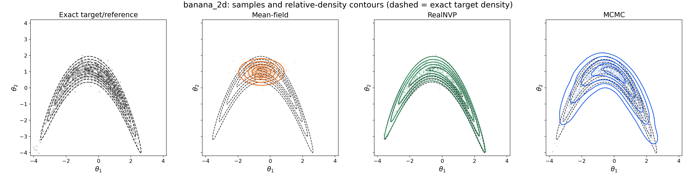

Consider the Bayesian inference problem of determining the posterior distribution of a latent variable $theta$ given observed data $y$. The posterior is given by Bayes' theorem:
$$
p(\theta | y) = p(y | \theta) p(\theta)/ p(y)
$$
where $p(y | \theta)$ is the likelihood, $p(\theta)$ is the prior, and $p(y)$ is the marginal likelihood or evidence. The standard approach in Bayesian computation, when the posterior is not of a conjugate form, is to use Markov Chain Monte Carlo (MCMC) methods to sample from the posterior. However, MCMC can be computationally expensive, so people sometimes resort to approximate methods where they approximate the posterior with a simpler distribution. 

One such method is the **variational inference**, which approximates the posterior $p(\theta | y)$ with a more tractable distribution $q_\phi(\theta)$ from the model class $\{q_\phi\}_\phi$.Using the KL divergence, we have 
$$
\mathrm{KL}(q_\phi(\theta) || p(\theta | y)) = \mathbb{E}_{q_\phi} \left[ \log q_\phi(\theta) - \log p(\theta | y) \right]
$$
which is non-negative by definition, and is zero if and only if $q_\phi(\theta) = p(\theta | y)$ almost everywhere. Therefore, for a sufficiently rich model class $\{q_\phi\}_\phi$, we can find a $q^*$ by minimising the KL divergence of above to be close to the true posterior.

Below, we will describe the most common way to perform variational inference, which is to maximise the evidence lower bound (ELBO). We can rewrite the KL divergence as follows:
$$
\begin{split}
\mathrm{KL}(q_\phi(\theta) || p(\theta | y)) &= \mathbb{E}_{q_\phi} \left[ \log q_\phi(\theta) - \log p(\theta | y) \right] \\
&= \mathbb{E}_{q_\phi} \left[ \log q_\phi(\theta) - \log [p(\theta, y) / p(y)] \right] \\
&= \log p(y) - \underbrace{\mathbb{E}_{q_\phi} \left[ -\log q_\phi(\theta) + \log p(\theta, y) \right] }_{\mathrm{ELBO}}. \\
\end{split}
$$

Focusing on the second term above which we call the ELBO, we have the following: 
$$
\begin{split}
\log p(y) &= \mathrm{ELBO} + \mathrm{KL}(q_\phi(\theta) || p(\theta | y)) \\
\log p(y) &\ge \mathrm{ELBO}, \quad \text{with equality iff }~\mathrm{KL}(q_\phi(\theta)  || p(\theta | y)) = 0 \Leftrightarrow q_\phi(\theta) = p(\theta|y)\\
\end{split}
$$
which explains the name of "evidence lower bound" -- $p(y)$ is the evidence and the KL divergence is non-negative. Next, we have the following:
$$
\begin{split}
\mathrm{ELBO} &= \log p(y) - \mathrm{KL}(q_\phi(\theta) || p(\theta | y)) \\
\underset{\phi}{\mathrm{argmax}} ~\mathrm{ELBO} &= \underset{\phi}{\mathrm{argmax}} \left[ \log p(y) - \mathrm{KL}(q_\phi(\theta) || p(\theta | y)) \right]\\
&= \underset{\phi}{\mathrm{argmin}} ~\mathrm{KL}(q_\phi(\theta) || p(\theta | y)) \\
\end{split}
$$
so maximising the ELBO w.r.t. the variational parameters $\phi$ is equivalent to minimising the KL divergence between the variational distribution $q_\phi(\theta)$ and the true posterior $p(\theta | y)$, implying that the ELBO is a reasonable objective function to optimise for.

